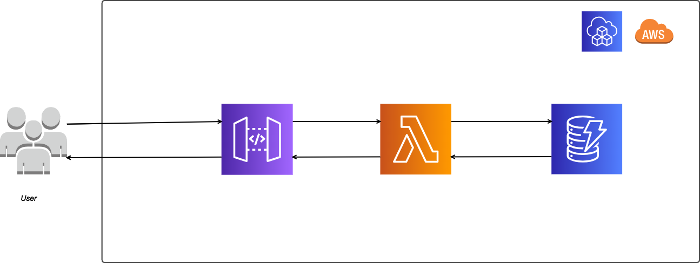

<h1>AWS Serverless Data Logging with DynamoDB, Lambda, and API Gateway</h1>

## Fully Serverless Backend with Terraform 

This project demonstrates how to build a fully serverless backend using AWS Lambda, API Gateway, and DynamoDB, all provisioned and managed through Terraform, an Infrastructure as Code (IaC) tool. The serverless architecture ensures scalability, cost-effectiveness, and minimal management overhead, while Terraform allows for streamlined resource provisioning and easy reuse of code. 

By leveraging Terraform, the entire infrastructure can be defined in code, making it simple to replicate or modify the project for similar use cases with minimal changes. This approach not only improves efficiency but also enhances visibility into the resources used by the application, ensuring optimal resource management and enabling quick adjustments to meet varying project needs.

The reusability of the Terraform modules allows you to deploy similar serverless applications in just a few steps, making this project an excellent foundation for creating, managing, and scaling serverless services.

## Prerequisites

Before deploying this project, ensure you have the following set up:

1. **AWS Account**  
   You will need an active AWS account to provision the required services, such as Lambda, API Gateway, and DynamoDB.

2. **AWS CLI**  
   Install the [AWS CLI](https://aws.amazon.com/cli/) and configure it with your AWS user credentials. This ensures that Terraform can communicate with your AWS environment.
   
   To configure the AWS CLI, run the following command and follow the prompts to enter your AWS access key, secret key, and default region:
  
3. **Terraform CLI** 
    Install the [Terraform CLI](https://developer.hashicorp.com/terraform/tutorials/aws-get-started/install-cli) to define and manage your infrastructure as code. Ensure that it's properly configured to interact with your AWS account.

3. **Basic Python Knowledge**
    Familiarity with Python is required to write and understand the AWS Lambda function used in this project. This project includes a Lambda function written in Python to handle serverless logic.

## Setup and Installation

git clone https://github.com/SankaW/AWS_API-Lambda-Dynamodb_with_terraform/

terraform init
terraform plan
terraform apply

Refer this base project to understand [Essential Terraform Commands](https://github.com/SankaW/Host_static_web_on_S3_terrafrom?tab=readme-ov-file/) 

## API Endpoints

This project creates a fully functional REST API to interact with DynamoDB for managing warehouse robot logs. The infrastructure, including API Gateway and Lambda integrations, is fully defined using Terraform. Once deployed, the API Gateway is automatically created with all necessary resources and methods.

### Using the API
After deploying the project, you will only need to copy the API Key generated for the API Gateway. If you're using Postman, you can export the API configuration directly from the AWS API Gateway console's "Stage" section. Import the configuration into Postman, and you're ready to test the API endpoints.

### Available Endpoints
The following endpoints are created for managing logs in DynamoDB:

1. **GET** `/logs/{id}`: Retrieve a specific log by its ID.
2. **POST** `/logs`: Add a new log entry.
3. **DELETE** `/logs/{id}`: Delete a specific log by its ID.
4. **GET** `/logs`: Retrieve all log entries.

### Terraform Code for API Gateway

All the resources and methods for the API Gateway are defined in the `api_gateway.tf` file. This includes:

- REST API resource creation (`/logs` and `/logs/{id}`)
- Method integrations (GET, POST, DELETE)
- Deployment to the `prod` stage
- API Key and Usage Plan configuration

Please refer to the [api_gateway.tf](api_gateway.tf) file for the full Terraform code implementation.

